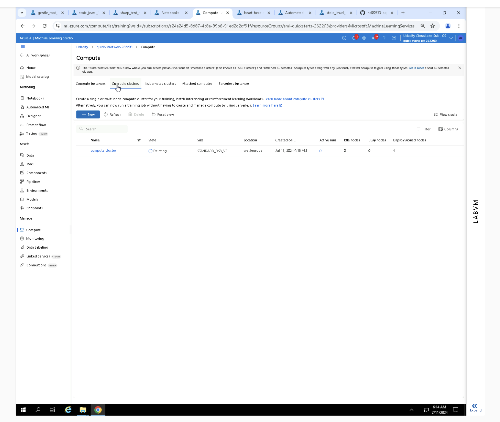

*NOTE:* This file is a template that you can use to create the README for your project. The *TODO* comments below will highlight the information you should be sure to include.

# Your Project Title Here
In this project, we utilized a dataset on heart failure (accessible at https://www.kaggle.com/datasets/andrewmvd/heart-failure-clinical-data). The dataset was acquired from Kaggle and subsequently imported into Azure ML Studio where it was registered. It encompasses demographic and health-related information, including mortality indicators. Our primary objective involves leveraging machine learning to predict early detection of heart failure.

Heart failure, often stemming from cardiovascular diseases, is a prevalent condition. This dataset comprises 12 distinct features that aid in predicting mortality related to heart failure. Employing AutoML and Hyperparameter Tuning is crucial in achieving early detection and effective management, highlighting the pivotal role of machine learning models in this endeavor.

## Dataset
The heart failure dataset (available at https://www.kaggle.com/datasets/andrewmvd/heart-failure-clinical-data) includes the following columns: age, anaemia, creatinine phosphokinase, diabetes, ejection fraction, high blood pressure, platelets, serum creatinine, serum sodium, sex, smoking, time, and DEATH_EVENT. It comprises medical records from 299 patients diagnosed with heart failure.

### Task
Heart failure, a frequent occurrence stemming from cardiovascular diseases (CVDs), is addressed in this dataset through 12 predictive features for mortality. The rationale for employing AutoML and Hyperparameter Tuning lies in the urgency of early detection and effective management, where machine learning models can play a pivotal role.

### Access
We downloaded the data manually from Kaggle and proceeded to register it in Azure ML Studio by uploading the CSV file and registering it as an Azure ML dataset.

## Automated ML
Primary Metric ("primary_metric": "accuracy"): This indicates that the main measure used to assess model performance is accuracy. Accuracy measures the ratio of correct predictions to the total predictions made by the model. It's commonly used for classification tasks where the goal is to predict discrete labels.

Experiment Timeout ("experiment_timeout_minutes": 18): This sets a maximum duration for the AutoML experiment to run, which is 15 minutes in this case. If the experiment doesn't complete within this timeframe, it will stop, ensuring efficient use of computational resources and preventing indefinite runs.

Max Concurrent Iterations ("max_concurrent_iterations": 5): This specifies the maximum number of model training iterations that can run simultaneously. By allowing up to 5 iterations concurrently, the experiment can utilize available computational resources effectively, potentially speeding up the overall process.

These adjustments simplify the technical terms while retaining the core meaning and purpose of each parameter in the context of AutoML experimentation for predicting the "DEATH_EVENT" in a dataset.

### Results
The best Auto ML experiment model is a Voting Ensemble

Best Model Run ID: AutoML_143ba73d-8d16-4983-b4ce-0ca57dfcd14e_48

Best Model Metrics: {'accuracy': 0.8931034482758621, 'log_loss': 0.353441052644468, 'average_precision_score_micro': 0.9292984353526347, 'matthews_correlation': 0.7650568173624568, 'AUC_macro': 0.9235436718443012, 'recall_score_micro': 0.8931034482758621, 'AUC_weighted': 0.9235436718443012, 'precision_score_weighted': 0.9051633886547679, 'f1_score_micro': 0.8931034482758621, 'precision_score_macro': 0.8997582096266308, 'balanced_accuracy': 0.8678931332778586, 'recall_score_macro': 0.8678931332778586, 'norm_macro_recall': 0.7357862665557173, 'f1_score_weighted': 0.8902325025572008, 'precision_score_micro': 0.8931034482758621, 'AUC_micro': 0.9273452239397543, 'average_precision_score_weighted': 0.9357174038086257, 'f1_score_macro': 0.8729045755516814, 'recall_score_weighted': 0.8931034482758621, 'weighted_accuracy': 0.9089548460902614, 'average_precision_score_macro': 0.9167355168705992, 'accuracy_table': 'aml://artifactId/ExperimentRun/dcid.AutoML_143ba73d-8d16-4983-b4ce-0ca57dfcd14e_48/accuracy_table', 'confusion_matrix': 'aml://artifactId/ExperimentRun/dcid.AutoML_143ba73d-8d16-4983-b4ce-0ca57dfcd14e_48/confusion_matrix'}

Best Model Accuracy: 0.8931034482758621

More details on best Model Pipeline(steps=[('datatransformer',
                 DataTransformer(enable_dnn=False, enable_feature_sweeping=True, is_cross_validation=True, working_dir='/mnt/batch/tasks/shared/LS_root/mounts/clusters/notebook262203/code/Users/odl_user_262203')),
                ('prefittedsoftvotingclassifier',
                 PreFittedSoftVotingClassifier(classification_labels=array([0, 1]), estimators=[('29', Pipeli...ample_bytree=1, eta=0.4, gamma=0.1, max_depth=10, max_leaves=127, n_estimators=50, objective='reg:logistic', problem_info=ProblemInfo(gpu_training_param_dict={'processing_unit_type': 'cpu'}), reg_alpha=0.8333333333333334, reg_lambda=1.1458333333333335, subsample=0.8, tree_method='auto'))]))], flatten_transform=False, weights=[0.2, 0.1, 0.2, 0.1, 0.1, 0.1, 0.1, 0.1]))])

## Hyperparameter Tuning
RandomParameterSampling - This is a strategy used to randomly sample hyperparameters for model training. During the experiment, the ML framework will randomly select values from the specified choices for each hyperparameter.

learning_rate: The rate at which the model learns during training. The choices given are 0.001,0.01,0.02, 0.05, 0.1, 0.25 ,0.75 , 1.0.
n_estimators: The number of trees in an ensemble model (like a Random Forest or Gradient Boosting). The choices are 1,3 , 5,7, 10,15,20, 25.

BanditPolicy = This is an early stopping policy that helps in terminating poorly performing runs early, based on performance compared to the best run.

evaluation_interval: Specifies how often (in terms of number of iterations) the policy should evaluate the performance of the runs. Here, it is set to 3, meaning the performance will be checked every 3 iterations.
slack_factor: This sets the tolerance level for how much worse a run can perform relative to the best run before being terminated. A slack_factor of 0.2 means that a run can perform up to 20% worse than the best performing run before it is stopped.

In this project we used Gradient boosting as it builds an ensemble of trees sequentially, where each tree tries to correct the errors of the previous one. This iterative process often results in high predictive accuracy.  It is especially useful when you need a model that can capture complex patterns in the data while still being interpretable and customizable.

### Results
Best Model Run ID: HD_15e83d28-d264-44e2-b7db-3393e1c887b8_9

Best Model Metrics: {'Learning Rate:': 0.75, 'Number Estimators:': 7, 'Accuracy': 0.7666666666666667}

Best Model Accuracy: 0.7666666666666667

## Model Deployment
We deployed the best model from the AutoML experiment as a web service endpoint and tested it with three randomly chosen samples from the dataset.
url= 'http://6dd7cb43-96ce-4ace-93ed-5fb8e2ef9555.westeurope.azurecontainer.io/score'

data =  {
  "data": [
    {
      "age": 25.0,
      "anaemia": 0,
      "creatinine_phosphokinase": 0,
      "diabetes": 1,
      "ejection_fraction": 0,
      "high_blood_pressure": 1,
      "platelets": 0.0,
      "serum_creatinine": 0.0,
      "serum_sodium": 0,
      "sex": 1,
      "smoking": 1,
      "time": 0
    }
  ]
}

output - b'[1]'
## Screen Recording

## Cluster and service delete

